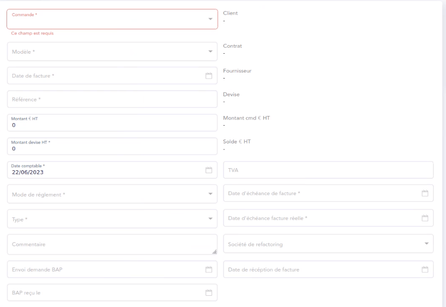

= Hackaton: partie frontend
:toc: auto
:toc-title: Sommaire

== Saisie d'une facture dans IQ

== Exécution

python -m streamlit run app.py

http://localhost:8501/

== Template de la saisie

[source, json]
----
include::template_saisie.json[]
----